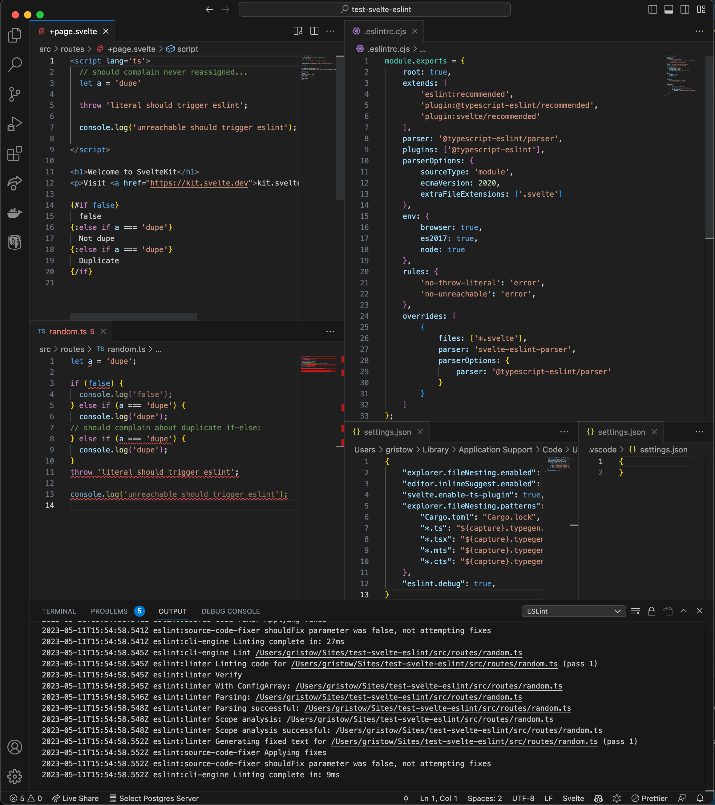

# test-svelte-eslint

This project was created via `npm create svelte@latest`.

At least on my machine, svelte files are not linting, but other files are.

See:
 - `./src/routes/+page.svelte` (does not lint)
 - `./src/routes/random.ts` (lints)

